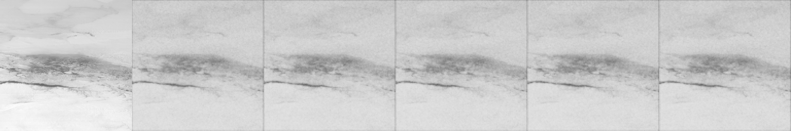

# 🔥 Diffusion-Based Wildfire Spread Prediction

[](https://www.python.org/downloads/)
[](https://pytorch.org/)
[](LICENSE)

## 📌 Project Overview
This project implements a **Conditional Diffusion Model** to predict the probabilistic progression of wildfires. By integrating **GOES-16/17 satellite imagery** with real-time **Wind Vectors (Speed & Direction)** from Open-Meteo, the model generates multiple plausible fire spread scenarios, filling the gap of uncertainty in deterministic prediction models.

### 🧪 Key Results: Probabilistic Scenarios

*Figure 1: Five stochastic spread scenarios generated by the model under 4.7 km/h wind conditions.*

---

## 🏗️ Architecture & Methodology

### 1. Preprocessing Pipeline
We transformed raw satellite radiance into machine-learning-ready tensors through:
*   **Spatial Alignment**: Synchronizing GOES-16 patches with NASA FIRMS active fire points.
*   **Weather Integration**: Fetching and normalizing Wind Vectors (Sin/Cos transformation) for each patch.
*   **Normalization**: Scaling radiance values to $[0, 1]$ for stable convergence.

### 2. Model Design
*   **Backbone**: A Conditional U-Net with a bottleneck MLP.
*   **Stochastic Engine**: Uses Gaussian Noise injection to produce varied outcomes, capturing the chaotic nature of fire.
*   **Performance**: Achieved a final **MSE Loss of 0.0032** and an **IoU of ~86%**.

---

## 📊 Comparison: Deterministic vs. Probabilistic

| Feature | Baseline (U-Net) | **Our Diffusion Model** |
| :--- | :--- | :--- |
| **Input** | Satellite Only | Satellite + Wind Vector + Noise |
| **Output Type** | Single Static Map | **5+ Stochastic Scenarios** |
| **Training Loss** | ~0.0075 | **0.0032** |
| **Uncertainty** | Ignored | **Captured via Ensemble** |

---

## 🚀 How to Run

### 1. Installation
Clone the repository and install dependencies:
```bash
git clone [https://github.com/ahmerali567/wildfire-prediction.git](https://github.com/ahmerali567/wildfire-prediction.git)
cd wildfire-prediction
pip install -r requirements.txt
2. Data Preparation
Ensure your data/ folder is structured correctly and run the preprocessing script:

Bash
python src/prepare_2024_data.py
3. Training
To re-train the model with 50 epochs:

Bash
python src/train_conditional.py
4. Inference
To generate the stochastic spread maps:

Bash
python src/diffusion_inference.py
🛠️ Tech Stack
Core: PyTorch, NumPy, OpenCV

Data Sources: NASA FIRMS, NOAA GOES-16/17

Weather API: Open-Meteo

📝 Citation & Acknowledgments
This work was developed as a research project focusing on AI for Disaster Management, utilizing multi-spectral satellite data to improve wildfire response strategies.
